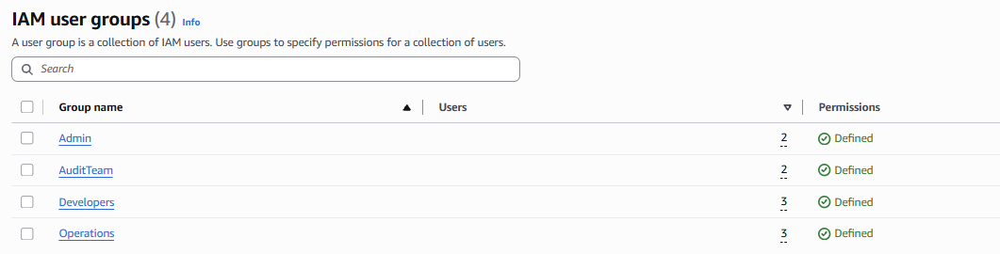
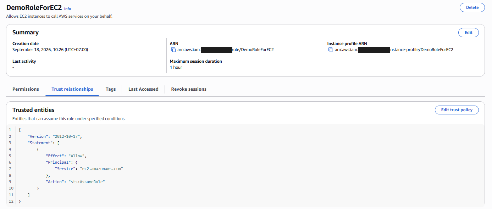

# IAM — Identity and Access Management

Five hands-on parts covering IAM — from user/group permissions through
roles, CLI access, and security auditing — built while working through
AWS SAA-C03 Section 4.

## Progress

| Part | Topic | Status |
|---|---|---|
| 1 | Multi-group cumulative permissions | ✅ Done |
| 2 | Password Policy + MFA | 📋 Planned |
| 3 | IAM Roles | ✅ Done |
| 4 | Access Keys + CLI | 📋 Planned |
| 5 | Security Tools (Credential Report + Access Advisor) | 📋 Planned |

## Lessons learned across this lab

- **`SecurityAudit` does not grant `s3:GetObject`** — only read access to
  config metadata, not object content. Don't infer a managed policy's
  permissions from its name — test it. *(Part 1)*
- **Creating an EC2 role through the Console also creates a matching
  Instance Profile automatically** — via CLI/SDK these are two separate
  objects that have to be created and linked explicitly. *(Part 3)*

---

## Part 1: Multi-group cumulative permissions ✅

A user's effective IAM permissions are the union of every group they
belong to — proved with a 3-group / 6-user scenario and Policy Simulator.

Full write-up, scenario, results, and screenshots

### What this lab shows

A user's effective IAM permissions are the **union** of every group they
belong to — not just their "primary" group. This lab builds a 3-group /
6-user setup where two users sit in two groups each, then proves the union
with IAM Policy Simulator.

### Scenario

| Group | Attached policy | Members |
|---|---|---|
| `Developers` | `AmazonEC2FullAccess` | Alice, Bob, Charles |
| `AuditTeam` | `SecurityAudit` | Charles, David |
| `Operations` | `AmazonS3FullAccess` | David, Edward, Fred |

Charles and David are each in two groups, so they each accumulate permissions
from two policies at once — confirmed on their own group membership pages:

### Tagging decision

Each user got a `Department` tag. IAM allows exactly one value per tag key,
so Charles and David — who don't map cleanly to a single department —
needed a deliberate choice.

**Decision:** tag both as `Department: AuditTeam`, since that's the trait
that makes them different from everyone else in the setup, rather than
arbitrarily picking one of their two "home" groups.

**Trade-off to remember for ABAC later:** this tag carries no information
about their *other* group membership. If a future attribute-based policy
grants access to anyone tagged `Department=Developers`, Charles won't match
it even though he also has developer permissions. Tags here are for
search/reporting — they don't drive permissions (that's what groups do).

### Result: Policy Simulator

**Charles (Developers + AuditTeam)**

| Action | Result | Why |
|---|---|---|
| `ec2:RunInstances` | ✅ Allowed | `AmazonEC2FullAccess` via Developers |
| `s3:GetBucketAcl` | ✅ Allowed | `SecurityAudit` via AuditTeam |

**David (AuditTeam + Operations)**

| Action | Result | Why |
|---|---|---|
| `s3:PutObject` | ✅ Allowed | `AmazonS3FullAccess` via Operations |
| `ec2:DescribeInstances` | ✅ Allowed | `SecurityAudit` via AuditTeam |
| `ec2:RunInstances` | ⛔ Denied | Not a member of Developers |

### Clean up

All 6 users and 3 groups were deleted after the lab — users first, then
groups (some consoles block group deletion while members remain).

---

## Part 2: Password Policy + MFA 📋

Custom password policy + virtual MFA on the root account.

Full write-up (coming soon)

_Not started yet._

---

## Part 3: IAM Roles ✅

An IAM Role bundles two things: a **trust policy** (who is allowed to
assume it) and a **permission policy** (what it can do once assumed).
This lab creates a role for EC2 and verifies both halves directly in the
console.

Full write-up, scenario, results, and screenshots

### What this lab shows

Unlike a user, a role has no long-term credentials — it's assumed via AWS
STS (`sts:AssumeRole`), which issues temporary credentials that expire.
Roles are how AWS services (EC2, Lambda, etc.), other AWS accounts, or
federated identities get scoped, expiring access instead of a shared
long-term secret.

### Scenario

Created an EC2 role from the console with two settings:

- **Trusted entity:** AWS service → EC2 (this becomes the trust policy —
  `Principal: ec2.amazonaws.com`, `Action: sts:AssumeRole`)
- **Permission policy:** `IAMReadOnlyAccess` (read-only access to IAM)
- **Role name:** `DemoRoleForEC2`

### Result

**Trust relationships** — confirms EC2 is the only trusted entity that can
assume this role:

**Permissions** — confirms `IAMReadOnlyAccess` is attached:

### Note on Instance Profiles

Creating this role through the console silently created a matching
**Instance Profile** (`arn:aws:iam::<account-id>:instance-profile/DemoRoleForEC2`)
— this is the actual object an EC2 instance attaches to; the role lives
inside it. The console hides this distinction. Via CLI/SDK, both the role
and the instance profile must be created and linked as separate steps.

This role isn't attached to a running EC2 instance yet — that happens once
the EC2 section of the course is reached.

---

## Part 4: Access Keys + CLI 📋

Full write-up (coming soon)

_Not started yet._

---

## Part 5: Security Tools 📋

IAM Credentials Report + IAM Access Advisor.

Full write-up (coming soon)

_Not started yet._

---

See [`INSTRUCTIONS.md`](./INSTRUCTIONS.md) for step-by-step reproduction of
each part.
