# IAM — Identity and Access Management

Five hands-on parts covering IAM — from user/group permissions through
roles, CLI access, and security auditing — built while working through
AWS SAA-C03 Section 4.

## Progress

| Part | Topic | Status |
|---|---|---|
| 1 | Multi-group cumulative permissions | ✅ Done |
| 2 | Password Policy + MFA | ✅ Done |
| 3 | IAM Roles | ✅ Done |
| 4 | Access Keys + CLI | ✅ Done |
| 5 | Security Tools (Credential Report + Access Advisor) | ✅ Done |

## Lessons learned across this lab

- **`SecurityAudit` does not grant `s3:GetObject`** — only read access to
  config metadata, not object content. Don't infer a managed policy's
  permissions from its name — test it. *(Part 1)*
- **Creating an EC2 role through the Console also creates a matching
  Instance Profile automatically** — via CLI/SDK these are two separate
  objects that have to be created and linked explicitly. *(Part 3)*
- **CLI and Console enforce the exact same IAM policy** — there is no way
  to get broader access by switching methods. Verified by comparing
  `aws iam list-users` output against the Console. *(Part 4)*
- **A real access key had been sitting inactive for 176 days** without
  anyone noticing — found on this account's own `admin_korpot` user, not a
  hypothetical. Kept it (rather than deleting immediately) as live evidence
  for the least-privilege lesson in Part 5. *(Part 4 → Part 5)*
- **`AdministratorAccess` allowed 455 services — only ~25% had ever been
  touched.** Access Advisor's "services not accessed" filter surfaced
  roughly 340 unused services on a real admin user. Concrete number to use
  when discussing least privilege in interviews, not just theory.
  *(Part 5)*
- **MFA was set up on the IAM user (`admin_korpot`), not root** — this
  keeps root as a recovery path if the MFA device is ever lost, instead of
  risking a total lockout. *(Part 2)*
- **An explicit Deny always overrides an Allow, even under
  `AdministratorAccess`.** Tested directly: an inline policy denying a
  single narrow action (`iam:DeleteRole`) was enough to block it, with
  Policy Simulator confirming *"Explicit deny found in 1 or more
  statements."* *(Part 1, bonus)*

---

## Part 1: Multi-group cumulative permissions ✅

A user's effective IAM permissions are the union of every group they
belong to — proved with a 3-group / 6-user scenario and Policy Simulator.

<details>
<summary>Full write-up, scenario, results, and screenshots</summary>

### What this lab shows

A user's effective IAM permissions are the **union** of every group they
belong to — not just their "primary" group. This lab builds a 3-group /
6-user setup where two users sit in two groups each, then proves the union
with IAM Policy Simulator.

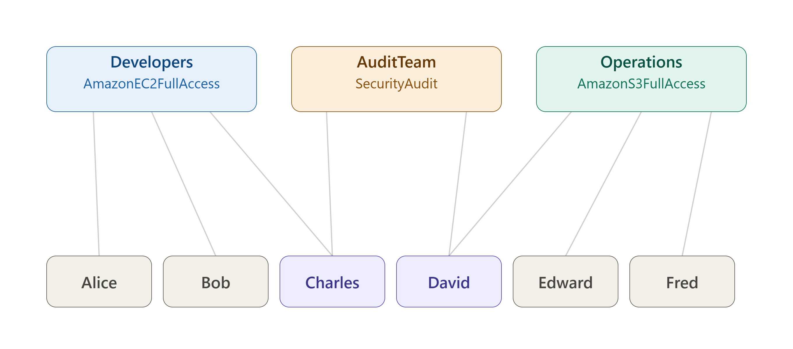

### Scenario

| Group | Attached policy | Members |
|---|---|---|
| `Developers` | `AmazonEC2FullAccess` | Alice, Bob, Charles |
| `AuditTeam` | `SecurityAudit` | Charles, David |
| `Operations` | `AmazonS3FullAccess` | David, Edward, Fred |

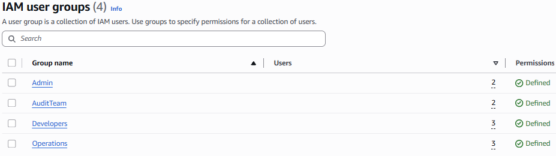

Charles and David are each in two groups, so they each accumulate permissions
from two policies at once — confirmed on their own group membership pages:

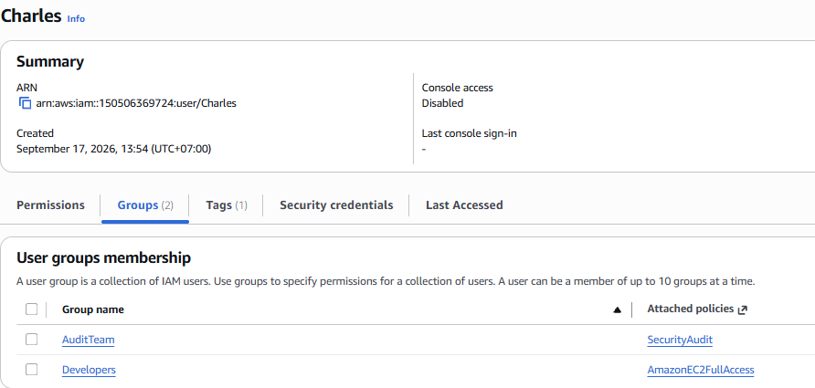

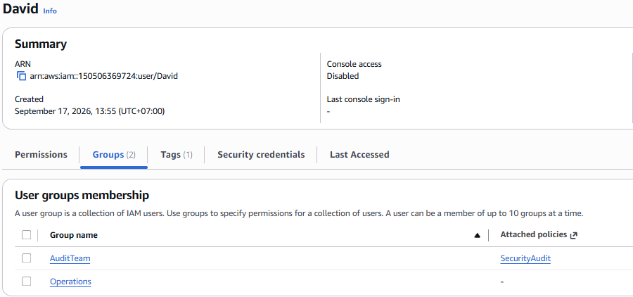

### Tagging decision

Each user got a `Department` tag. IAM allows exactly one value per tag key,
so Charles and David — who don't map cleanly to a single department —
needed a deliberate choice.

**Decision:** tag both as `Department: AuditTeam`, since that's the trait
that makes them different from everyone else in the setup, rather than
arbitrarily picking one of their two "home" groups.

**Trade-off to remember for ABAC later:** this tag carries no information
about their *other* group membership. If a future attribute-based policy
grants access to anyone tagged `Department=Developers`, Charles won't match
it even though he also has developer permissions. Tags here are for
search/reporting — they don't drive permissions (that's what groups do).

### Result: Policy Simulator

**Charles (Developers + AuditTeam)**

| Action | Result | Why |
|---|---|---|
| `ec2:RunInstances` | ✅ Allowed | `AmazonEC2FullAccess` via Developers |
| `s3:GetBucketAcl` | ✅ Allowed | `SecurityAudit` via AuditTeam |

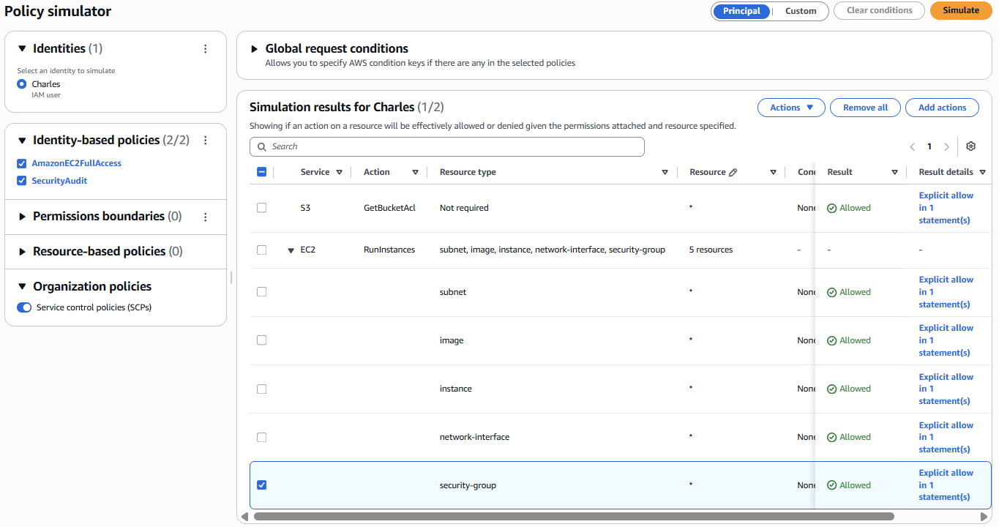

**David (AuditTeam + Operations)**

| Action | Result | Why |
|---|---|---|
| `s3:PutObject` | ✅ Allowed | `AmazonS3FullAccess` via Operations |
| `ec2:DescribeInstances` | ✅ Allowed | `SecurityAudit` via AuditTeam |
| `ec2:RunInstances` | ⛔ Denied | Not a member of Developers |

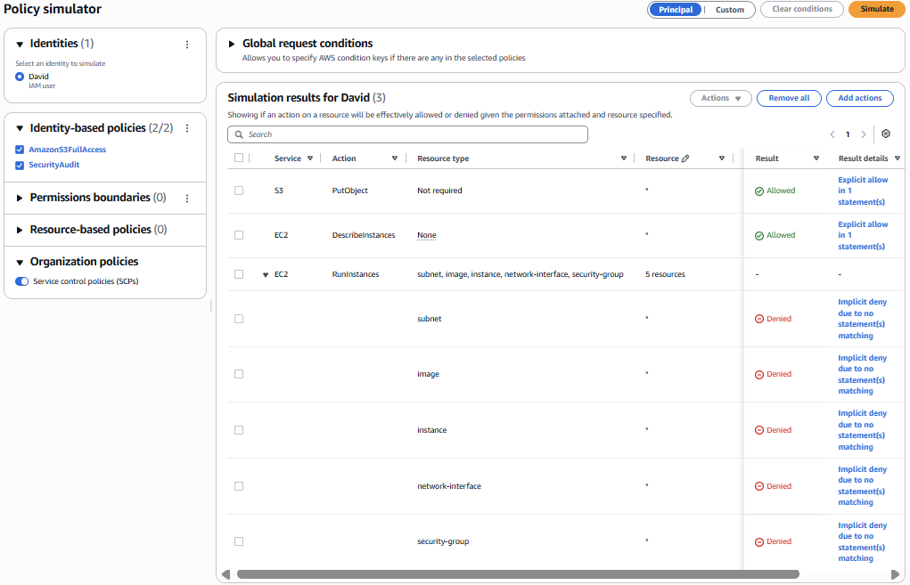

### Clean up

All 6 users and 3 groups were deleted after the lab — users first, then
groups (some consoles block group deletion while members remain).

</details>

---

## Part 2: Password Policy + MFA ✅

Password Policy and MFA add two independent layers of protection —
something you know plus something you have.

<details>
<summary>Full write-up, scenario, results, and screenshots</summary>

### What this lab shows

A password alone only protects against someone who doesn't know it — if it
leaks (phishing, reuse, a keylogger), that's the only barrier gone. MFA adds
a second, independent factor so a leaked password alone isn't enough.

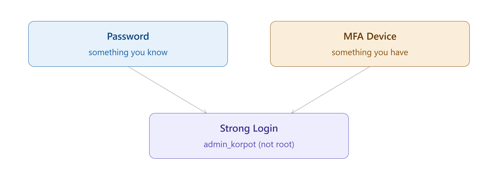

### Scenario

1. **Custom password policy** set at the account level: 14-character
   minimum, requires uppercase, lowercase, a number, and a non-alphanumeric
   character, expires every 90 days, prevents password reuse.
2. **Virtual MFA** enabled on the `admin_korpot` IAM user (an authenticator
   app), not the root account.

**Why the IAM user and not root:** losing the MFA device for root leaves no
higher authority to recover the account. Setting it up on `admin_korpot`
instead means root stays available as a recovery path if the device is
ever lost.

### Result

**Password policy**, configured and active:

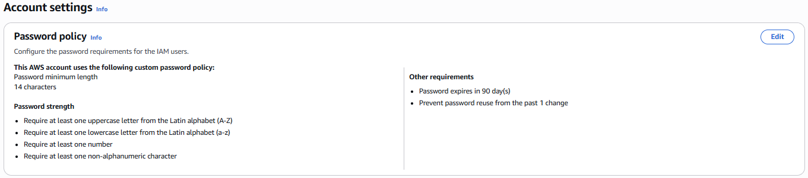

**MFA device** attached and verified — logging out and back in required a
code from the authenticator app before granting access:

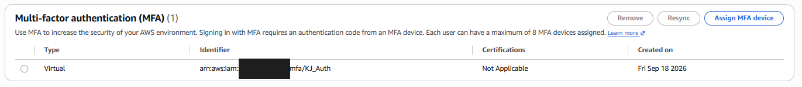

### Note on the QR code step

The QR code shown when pairing a virtual MFA device encodes the secret seed
used to generate codes — treated the same as a secret access key: never
screenshotted or saved anywhere it could leak.

</details>

---

## Part 3: IAM Roles ✅

An IAM Role bundles two things: a **trust policy** (who is allowed to
assume it) and a **permission policy** (what it can do once assumed).
This lab creates a role for EC2 and verifies both halves directly in the
console.

<details>
<summary>Full write-up, scenario, results, and screenshots</summary>

### What this lab shows

Unlike a user, a role has no long-term credentials — it's assumed via AWS
STS (`sts:AssumeRole`), which issues temporary credentials that expire.
Roles are how AWS services (EC2, Lambda, etc.), other AWS accounts, or
federated identities get scoped, expiring access instead of a shared
long-term secret.

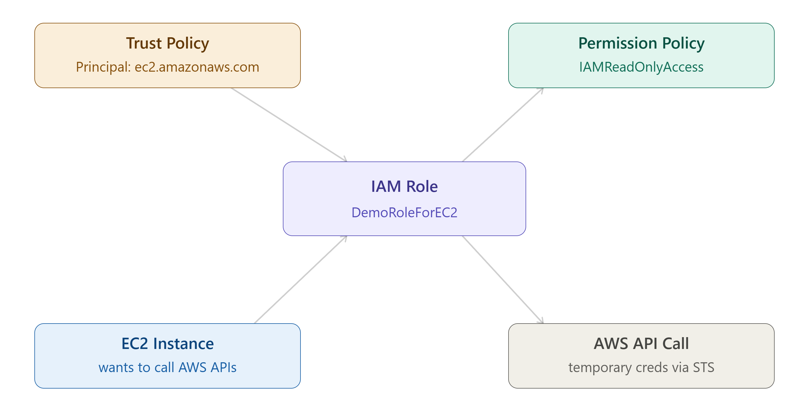

### Scenario

Created an EC2 role from the console with two settings:

- **Trusted entity:** AWS service → EC2 (this becomes the trust policy —
  `Principal: ec2.amazonaws.com`, `Action: sts:AssumeRole`)
- **Permission policy:** `IAMReadOnlyAccess` (read-only access to IAM)
- **Role name:** `DemoRoleForEC2`

### Result

**Trust relationships** — confirms EC2 is the only trusted entity that can
assume this role:


**Permissions** — confirms `IAMReadOnlyAccess` is attached:

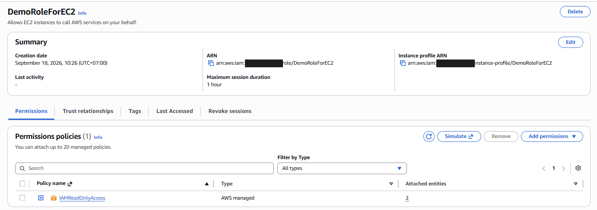

### Note on Instance Profiles

Creating this role through the console silently created a matching
**Instance Profile** (`arn:aws:iam::<account-id>:instance-profile/DemoRoleForEC2`)
— this is the actual object an EC2 instance attaches to; the role lives
inside it. The console hides this distinction. Via CLI/SDK, both the role
and the instance profile must be created and linked as separate steps.

This role isn't attached to a running EC2 instance yet — that happens once
the EC2 section of the course is reached.

</details>

---

## Part 4: Access Keys + CLI ✅

Console, CLI, and SDK all enforce the exact same IAM policy — there's no
way to get broader access by switching how you connect.

<details>
<summary>Full write-up, scenario, results, and screenshots</summary>

### What this lab shows

Access keys are long-term credentials (unlike a role's temporary ones) used
to authenticate the CLI and SDK. Whatever IAM policy applies to a user in
the Console applies identically when that same user calls AWS through the
CLI.

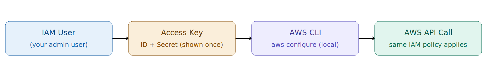

### Scenario

Before creating anything new, checked whether the CLI was already
configured on this machine:

```
$ aws sts get-caller-identity
{
    "UserId": "********************SA5SQ",
    "Account": "*********9724",
    "Arn": "arn:aws:iam::**********9724:user/admin_korpot"
}
```

It was — already set up from earlier work on the ClinicKids project — so no
new access key was created for this lab. The `admin_korpot` user already
had two access keys on file:

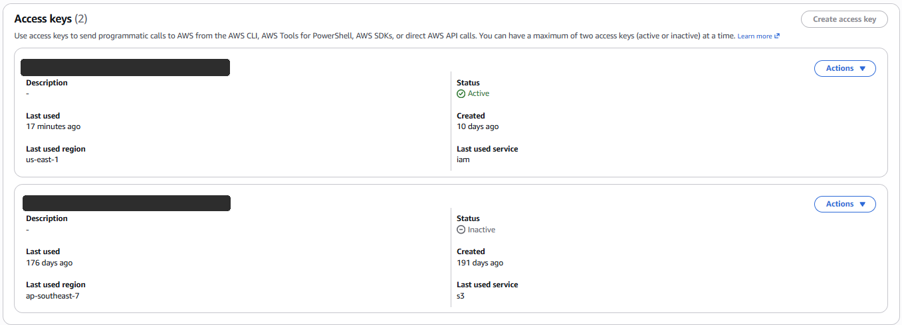

- **Key 1 (Active):** last used 7 days ago, service `cloudfront` — the key
  behind ClinicKids deployments.
- **Key 2 (Inactive):** unused for 176 days. Left in place on purpose as a
  real example of a stale credential for Part 5, rather than deleted
  immediately.

### Result

Ran `aws iam list-users` and compared the result against the same list
visible in the Console — identical, confirming the CLI enforces the same
permissions as the Console for this user.

### Note on safety

A Secret Access Key is shown by AWS exactly once, at creation. It's never
screenshotted or committed anywhere — this lab avoided creating a new one
specifically to avoid that exposure window entirely.

</details>

---

## Part 5: Security Tools ✅

Two tools, two different scopes, one goal: find what's unused and remove
it — the practical side of least privilege.

<details>
<summary>Full write-up, scenario, results, and screenshots</summary>

### What this lab shows

**IAM Credentials Report** works at the account level — one CSV covering
every user's credential status at once. **IAM Access Advisor** works at the
user level — showing exactly which services a specific user has actually
called, and when. Both point at the same goal: finding permissions and
credentials that are granted but never used.

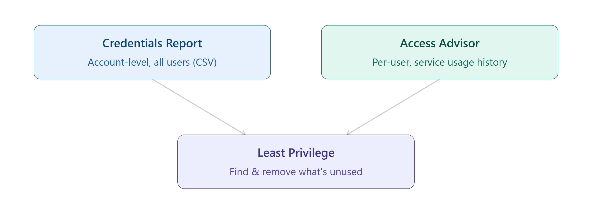

### Scenario

Opened Access Advisor for `admin_korpot` (last accessed tab) and filtered
by **"Services not accessed"** instead of scrolling the default alphabetical
list, where commonly-used services (IAM, EC2, STS) show up first and hide
the real signal.

### Result

Out of **455 services** allowed by `AdministratorAccess`, roughly **340
(~75%) had never been accessed** in the tracking period — services like AWS
App2Container, Alexa for Business, AWS Private Certificate Authority, and
Amazon Managed Workflows for Apache Airflow.

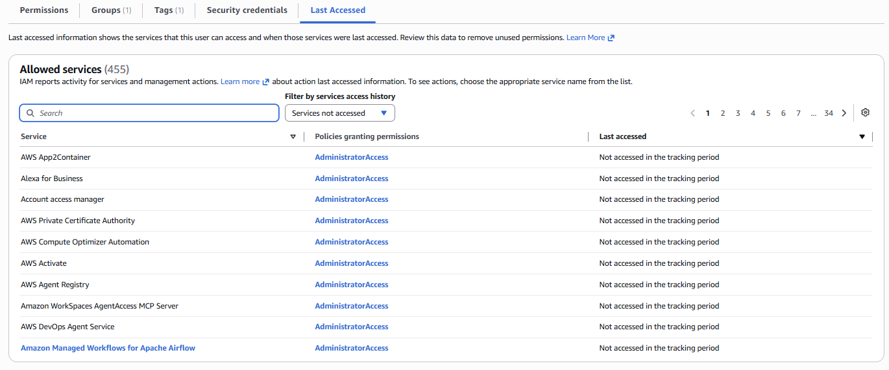

A separate Credentials Report wasn't pulled — the same underlying signal
(a stale, unused credential) was already visible directly in the Console
in Part 4: Access key 2, inactive for 176 days.

### Why this matters

A ~75% unused rate on a real admin account is a concrete number for
explaining least privilege in an interview, rather than reciting the
definition: broad managed policies like `AdministratorAccess` are
convenient but almost always far wider than what's actually used — Access
Advisor is how you find the gap and write a narrower custom policy instead.

</details>

---

See [`INSTRUCTIONS.md`](./INSTRUCTIONS.md) for step-by-step reproduction of
each part.
